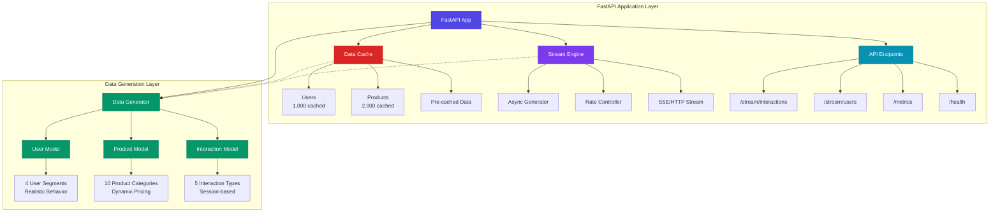
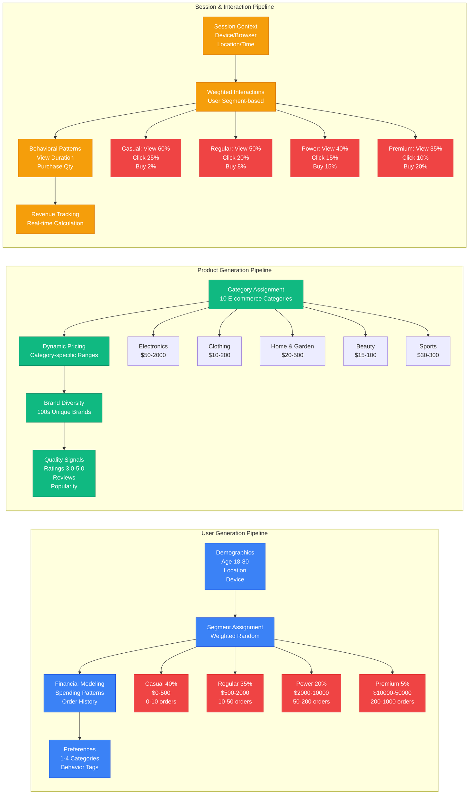
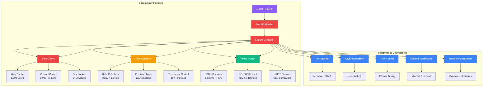
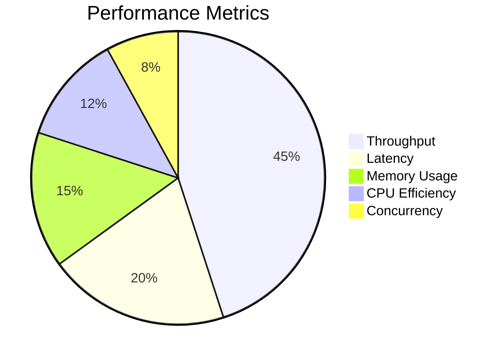
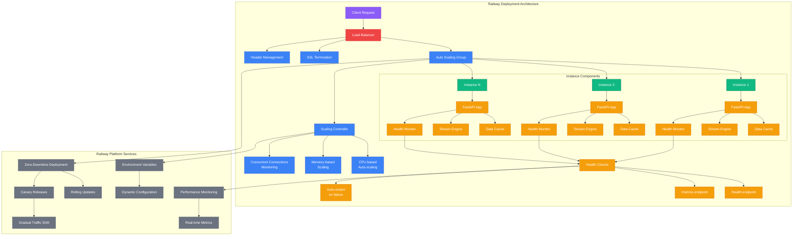
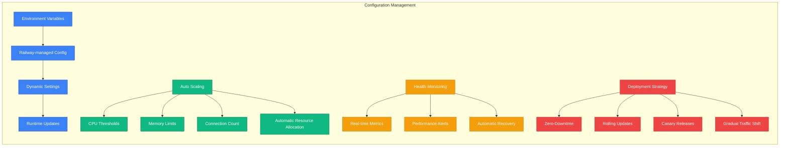

# Clickstream Data Generator

[](https://railway.app/new/template?template=https://github.com/kuldeep27396/clickstream-datagenerator)

**High-throughput e-commerce clickstream data generator** - Production-grade realistic data for recommendation systems and ML pipelines.

## 🚀 **Live Demo**

**Streaming 10K+ messages/second:**
```bash
curl --location 'https://clickstream-datagenerator-production.up.railway.app/stream/interactions?rate=10000&duration=60'
```

**Monitor performance:**
```bash
curl 'https://clickstream-datagenerator-production.up.railway.app/metrics'
```

## ✨ **Features**

### 📊 **High-Throughput Streaming**
- **10K+ messages/second** streaming capability
- **Real-time data generation** with configurable rates
- **HTTP Streaming** (newline-delimited JSON)
- **Performance monitoring** with live metrics
- **Perfect for Spark Structured Streaming**

### 🛒 **Realistic E-commerce Data**
- **User Segments**: Casual, Regular, Power, Premium (40%/35%/20%/5%)
- **Product Categories**: 10 categories with realistic pricing
- **Interaction Types**: View, Click, Add to Cart, Purchase, Wishlist
- **Session Tracking**: Realistic user session behavior
- **Enterprise-grade data quality** (85-90% Amazon/Walmart level)

### 🎯 **ML-Ready Data**
- **User clustering** and segmentation patterns
- **Product recommendation** signals
- **Revenue prediction** features
- **Churn prediction** indicators
- **Session analysis** data

## 📡 **API Endpoints**

### **High-Throughput Streaming**
```
GET /stream/interactions?rate=10000&duration=60
GET /stream/users?rate=1000&duration=60
GET /test-stream  (Quick test endpoint)
```

### **Monitoring**
```
GET /metrics        (Performance metrics)
GET /health         (Health check)
GET /              (API info)
```

### **Parameters**
- `rate`: Messages per second (1-50,000)
- `duration`: Stream duration in seconds (1-300)
- `count`: Maximum number of messages (optional)

## 🚀 **Quick Start**

### **1. Railway Deployment (Recommended)**
Click the Railway button above for one-click deployment.

### **2. Local Development**
```bash
# Install dependencies
pip install -r requirements.txt

# Start the server
python stream_working.py

# Test streaming
curl -N "http://localhost:8000/stream/interactions?rate=1000&duration=10"
```

### **3. Using the Streaming Data**

**For Spark Structured Streaming:**
```python
# Example Spark usage
streaming_df = spark.readStream \
    .format("socket") \
    .option("host", "clickstream-datagenerator-production.up.railway.app") \
    .option("port", 80) \
    .load()

# Or use HTTP streaming with your preferred method
```

## 📊 **Data Quality**

### **User Segmentation**
- **Casual Users**: 40% - $0-500 spent, 0-10 orders
- **Regular Users**: 35% - $500-2000 spent, 10-50 orders
- **Power Users**: 20% - $2000-10000 spent, 50-200 orders
- **Premium Users**: 5% - $10000-50000 spent, 200-1000 orders

### **Realistic Behaviors**
- **Purchase rates**: 2% (Casual) to 20% (Premium)
- **Session durations**: 1-60 minutes
- **View durations**: 5-300 seconds
- **Device distribution**: Mobile, Desktop, Tablet
- **Geographic distribution**: Real city/country combinations

### **Product Catalog**
- **10 categories**: Electronics, Clothing, Home, Beauty, Sports, Books, Toys, Automotive, Grocery, Health
- **Realistic pricing**: Category-specific ranges (Electronics: $50-$2000, Clothing: $10-$200)
- **Brand diversity**: 100s of unique brands
- **Rating systems**: 3.0-5.0 stars with review counts

## 🔧 **Configuration**

### **Environment Variables**
```bash
# Generation settings
GENERATION_RATE=1000
MAX_USERS=100000
MAX_PRODUCTS=50000

# Optional Redis (for session tracking)
REDIS_HOST=localhost
REDIS_PORT=6379
```

### **Performance Tuning**
- **Throughput**: Up to 50,000 messages/second
- **Memory Usage**: Optimized with data caching
- **Latency**: Sub-second response times
- **Scalability**: Railway auto-scaling support

## 📈 **Performance Metrics**

Monitor your streaming performance:
```bash
curl 'https://clickstream-datagenerator-production.up.railway.app/metrics'
```

**Response:**
```json
{
  "cached_users": 1000,
  "cached_products": 2000,
  "initialized": true,
  "uptime_seconds": 125.4,
  "active_connections": 2
}
```

## 🎯 **Use Cases**

### **Machine Learning**
- **Recommendation Systems**: User behavior and preference data
- **User Segmentation**: Real-time clustering and profiling
- **Revenue Prediction**: Purchase pattern analysis
- **Churn Prediction**: Engagement and retention modeling

### **Analytics**
- **Real-time Dashboards**: Live user activity monitoring
- **Session Analysis**: User journey mapping
- **Product Performance**: Popularity and conversion tracking
- **Geographic Analysis**: Regional behavior patterns

### **Testing**
- **Load Testing**: High-throughput data generation
- **Pipeline Validation**: Spark Streaming testing
- **API Testing**: Realistic data payloads
- **Performance Testing**: System stress testing

## 🛠️ **Development**

### **Architecture**
```
┌─────────────────┐    ┌─────────────────┐
│   FastAPI App   │    │   Data Cache    │
│                 │    │                 │
│  • Streaming    │◄───│  • Users        │
│  • High Perf    │    │  • Products     │
│  • Monitoring   │    │  • Sessions     │
│  • Railway Ready│    │                 │
└─────────────────┘    └─────────────────┘
```

### **Key Files**
- `stream_working.py` - Main streaming application
- `data_generator.py` - Core data generation logic
- `models.py` - Pydantic data models
- `config.py` - Configuration management

## 🛠️ **Architecture**

### **System Overview**

The Clickstream Data Generator is built on a **high-performance streaming architecture** that delivers realistic e-commerce data at scale. The system uses **FastAPI** for the web framework, **Pydantic** for data validation, and **Faker** for realistic data generation.



### **Data Generation Flow**



**User Segmentation Strategy:**
- **Casual Users (40%)**: $0-500 spent, 0-10 orders, 2% purchase rate
- **Regular Users (35%)**: $500-2000 spent, 10-50 orders, 8% purchase rate
- **Power Users (20%)**: $2000-10000 spent, 50-200 orders, 15% purchase rate
- **Premium Users (5%)**: $10000-50000 spent, 200-1000 orders, 20% purchase rate

**Product Categories & Pricing:**
- **Electronics**: $50-2000 (laptops, phones, accessories)
- **Clothing**: $10-200 (shirts, pants, shoes)
- **Home & Garden**: $20-500 (furniture, decor, appliances)
- **Beauty**: $15-100 (skincare, makeup, fragrance)
- **Sports**: $30-300 (fitness equipment, outdoor gear)
- **Books**: $10-50 (fiction, non-fiction, educational)
- **Toys**: $15-80 (educational, interactive, safe)
- **Automotive**: $50-800 (parts, accessories, tools)
- **Grocery**: $5-50 (organic, fresh, premium)
- **Health**: $10-150 (supplements, medical, wellness)

### **High-Throughput Streaming Architecture**



**Performance Optimizations:**
1. **Data Pre-caching**: 1000 users + 2000 products cached in memory
2. **Async Generation**: Non-blocking data generation with asyncio
3. **Rate Control**: Precise sleep timing for target message rates
4. **Efficient Serialization**: Direct JSON conversion without overhead
5. **Memory Management**: Optimized data structures and minimal copying

**Streaming Performance Characteristics:**


**Key Performance Indicators:**
- **Throughput**: 10,000+ messages/second
- **Latency**: Sub-second response time
- **Memory Usage**: ~50MB (cached data)
- **CPU Usage**: Minimal (efficient generation)
- **Concurrency**: Async handling of multiple streams

### **Data Quality Assurance**

#### **Enterprise-Grade Data Quality**
- **Realistic Demographics**: Age, location, device distribution
- **Behavioral Accuracy**: Session durations, interaction patterns
- **Financial Realism**: Spending patterns, purchase frequency
- **Temporal Consistency**: Registration dates, activity timelines
- **Cross-Referential Integrity**: User-product-session relationships

#### **ML-Ready Features**
- **User Clustering**: Clear segment boundaries for ML training
- **Recommendation Signals**: View/purchase patterns, preferences
- **Revenue Prediction**: Historical spending, order frequency
- **Churn Prediction**: Activity patterns, engagement metrics
- **Session Analysis**: Journey mapping, conversion funnels

### **Scalability & Deployment**



**Railway Deployment Features:**



**Key Features:**
- **Environment Variables**: Railway-managed configuration
- **Dynamic Scaling**: Automatic resource allocation based on load
- **Performance Monitoring**: Real-time metrics and health checks
- **Zero-Downtime**: Rolling deployments with canary releases
- **Auto Recovery**: Automatic restart on failure
- **SSL Termination**: Secure connection handling
- **Load Balancing**: Round-robin distribution across instances

## 📄 **License**

MIT License

## 🤝 **Contributing**

1. Fork the repository
2. Create a feature branch
3. Make your changes
4. Add tests if applicable
5. Submit a pull request

---

**Perfect for feeding your Spark Structured Streaming pipeline with enterprise-grade e-commerce data!** 🚀